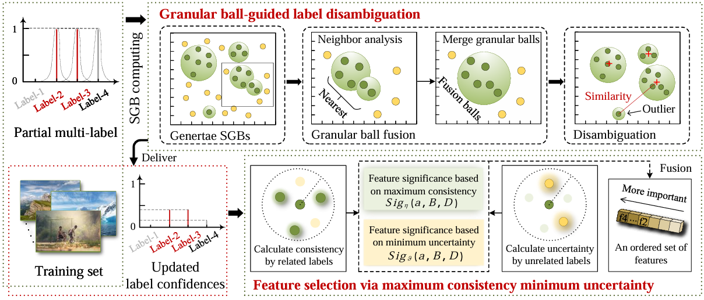

# PML feature selection with label disambiguation using granular-ball and fuzzy decision neighborhood rough set

Forthcoming in IEEE Transactions on Neural Networks and Learning Systems (TNNLS), 2025.

## Project Overview

This project implements a partial multi-label feature selection algorithm based on Fuzzy Decision Neighborhood Rough Set (FDNRS). The algorithm is specifically designed for handling feature selection problems in multi-label learning by combining neighborhood dependency and neighborhood uncertainty to evaluate feature importance.



### 1. Data Preprocessing

- Supports MinMax normalization and standardization preprocessing
- Flexible data preprocessing configuration

### 2. Parameterized Experiments

- Supports multiple radius parameter and α parameter combinations
- Configurable noise ratio experiments
- Automated parameter grid search

## Usage Instructions

### 1. Environment Requirements

```bash
pip install numpy scipy scikit-learn PySimpleGUI
```

### 2. Configure Datasets

Add dataset names to be processed in the `datasets_use.txt` file:

```
CHD_49
CAL500
```

### 3. Run the Program

```bash
python main.py
```

## Output Results

### 1. Feature Ranking Results

Results are saved in the `file_for_disambiguation/result/` directory, organized as follows:

```
result/
├── noise_ratio_{noise_ratio}/
│   └── {preprocessing_method}/
│       └── {dataset_name}/
│           └── {radius_parameter}_{alpha_parameter}.txt
```

Each result file contains feature indices ranked by importance.

### 2. Experiment Records

The program automatically generates a `file_for_disambiguation/dataset_record.csv` file, recording detailed information for each experiment:

- Dataset information (name, number of samples, features, labels)
- Experiment parameters (noise ratio, preprocessing method, radius parameter, α parameter)
- Running results (number of reduced features, running time)
- System information (running time, device name)

### 3. Feature Evaluation Function

```
SIG = α × Neighborhood_Dependency - (1-α) × Neighborhood_Uncertainty
```

## Experiment Configuration

### Feature Selection Strategy

Automatically determines the number of features to select based on feature dimensions:

- Dimensions > 1000: Select 10% of features
- 500 < Dimensions ≤ 1000: Select 20% of features
- 100 < Dimensions ≤ 500: Select 30% of features
- Dimensions ≤ 100: Select 40% of features

## Important Notes

1. **Data Format**: Input data should be in .mat format, containing 'features' and 'labels' fields
2. **Memory Usage**: Large-dimensional datasets may require significant memory
3. **Parallel Processing**: Adjust the number of parallel processes based on CPU cores
4. **Result Storage**: Ensure sufficient disk space for storing experimental results
